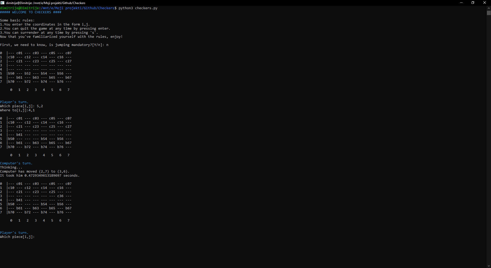

# Checkers
<<<<<<< HEAD
A game of checkers written using minmax algorithm and alpha-beta prunning.
=======
A game of checkers written in Python3 using minimax algorithm and alpha-beta pruning.
>>>>>>> 620e6aab5c094b50bb643bac9455a793501f6b8d

This was a project in my Algorithms and Data Structures course. We were asked to create a simple AI which can play its
moves in under 5 seconds.

